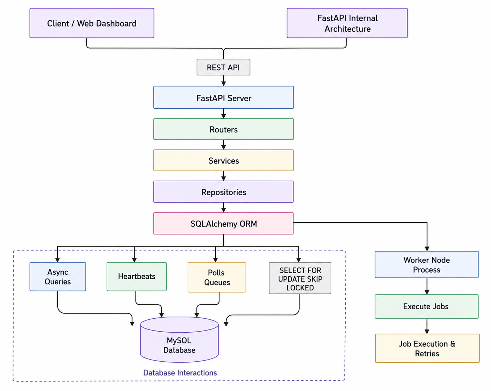
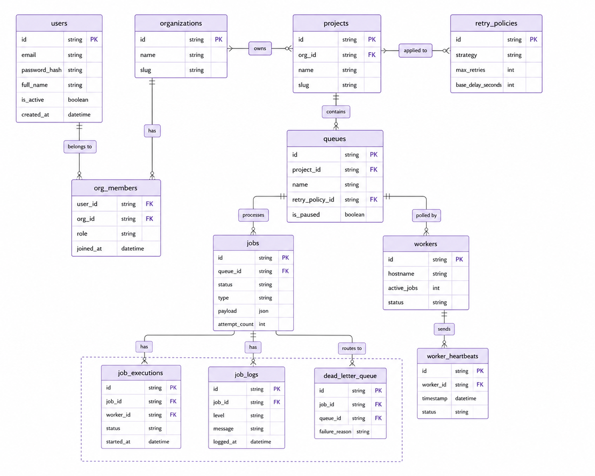

# ApexScheduler: Enterprise Multi-Tenant Job Engine

A high-concurrency, horizontally scalable distributed job scheduler engineered from scratch for multi-tenant background processing. Built with FastAPI and MySQL, this system implements advanced row-level locking patterns to guarantee strict task isolation and zero-race-condition queue pulling under heavy concurrent loads.

---

## 🏗️ System Architecture

The core architecture decouples ingestion from execution to ensure high throughput and horizontal scalability:

- **API Ingestion Nodes:** Stateless FastAPI instances handle tenant authentication, job submission validation, and real-time analytical reporting.
- **Database Layer:** A centralized MySQL database utilizing optimized `JSONB` indices for flexible task payloads and status indexing.
- **Worker Node Cluster:** Independent background worker processes running concurrent execution loops, capable of scaling dynamically to meet queue demands.

<p align="center">
  
</p>

---

## 🗄️ Database Entity Relationship (ER)

The relational schema is built on strict multi-tenant normalization rules:

- Ensures data isolation between distinct tenant organizations via foreign key cascading constraints.
- Utilizes a highly optimized compound index on `(status, run_at, priority DESC)` within the core jobs table to minimize polling overhead.

<p align="center">
  
</p>

## 🛠️ Local Installation & Execution Guide

Follow these sequential steps to configure, seed, and spin up the entire distributed system locally.

### 1. System Prerequisites
Ensure you have the following environments installed and configured on your machine:
* **Python:** Version 3.13 or higher
* **Database:** MySQL (v15+) cluster running locally or accessible via a remote connection string

### 2. Environment Setup
Create a `.env` file in the project's root directory and populate it with your local MySQL configurations and application security keys:

```env
DB_HOST=localhost
DB_PORT=5432
DB_USER=postgres
DB_PASSWORD=your_secure_password
DB_NAME=apex_scheduler_db
JWT_SECRET_KEY=your_custom_jwt_secret_signing_key_here
